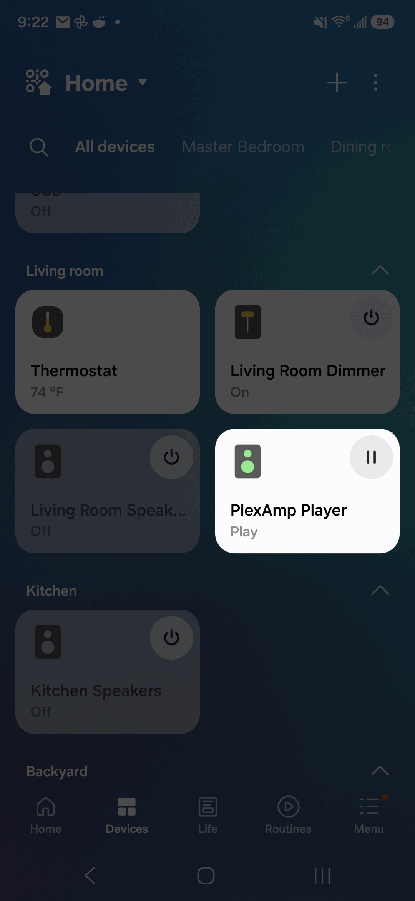

# SmartThings Edge Driver — PlexAmp Player

<table><tr>
<td valign="top">

A SmartThings Edge Driver that connects your SmartThings hub directly to a local
Plex Media Server and controls a headless PlexAmp instance over your LAN.

Useful if you have a PlexAmp instance connected directly to an amplifier or streamer
and want to control it from the SmartThings app (including routines and voice control).

**Features**

- **Playlist picker** — browse all your Plex audio playlists and start one with a tap (plays shuffled)
- **Now Playing** — track title, artist, album, and current playlist update automatically
- **Playback controls** — play, pause, stop, next track, previous track
- **Volume control** — 0–100 slider mapped directly to PlexAmp's volume
- **Auto-refresh** — polls PlexAmp on a configurable interval (default 30 s)
- **Instant update** — Now Playing refreshes immediately when you select a playlist
- Fully local — all Plex communication stays on your LAN

</td>
<td valign="top" align="right">

</td>
</tr></table>

---

## Requirements

- **Headless PlexAmp** (running on a Raspberry Pi or other device)
- A separate **desktop or laptop** running:
   - **Python 3**
   - **SmartThings CLI**
- **SmartThings Hub V2** (or later) on the same LAN as the PlexAmp instance<sup>[1]</sup>
- **Plex Media Server** (assumed running on your LAN, port 32400)

<small>[1] should also work with Aeotec hubs, but has not been tested</small>

---

## Setup

### 1. Set up the development system

You will want a desktop or laptop, we'll call this your "development machine". It should be something **other** than the PlexAmp or Plex Media Server systems. The following steps assume it is running Windows, and that you have administrator privileges. If you're using a different operating system, you will need to know how and when to adjust the process for that environment.

Open **Windows Command Prompt** (aka Terminal) as Administrator
- in the Windows Search box at the bottom left of your desktop, enter `cmd`
- from the right pane of the pop-up window, click on **Run as Administrator**
- navigate to the root of your file system
```bash
cd /
```   

Install **Git**
- using the Git CLI is generally the easiest, most straight-forward way to build this project.
- you can use other methods, such as downloading the .zip of the project directly from this page, but for this guide I will assume you are using Git
```bash
winget install --id Git.Git -e --source winget
```
- winget and Git require administrator rights, and will prompt for the administrator privileges if you did not already run the Windows Command Prompt as Administrator as described above

Create a directory for Git projects, if one does not exist
```bash
mkdir git
cd git
``` 

Check your **Python** version
```bash
python -V
```
   - if it returns `python: command not found` or if the version is less than 3.9, you'll want to install/update Python 3 (see online tutorials for "windows install python 3")
      - if you're running Windows, I highly recommend using the Python Install Manager (available for free in the Microsoft Store, or from the official Python website), it eases a lot of the frustrations you can have with Python and Windows

Check your Python **PIP** version
```bash
pip -V
```
  - if the system can not find PIP (`pip: command not found`), or the version reported is not 3.x or greater, install Python3 PIP (again, Google "windows install python pip 3", or read the documentation for Python Install Manager)

Install and set-up the **SmartThings Command Line Interface** (or CLI)
   - installation instructions are here: [installation guide](https://github.com/SmartThingsCommunity/smartthings-cli)
   - the CLI does require Node.js

Install or **clone this project** to your development machine
```bash
# Clone this repo
git clone https://github.com/carlsteinhilber/plex-edge-driver.git
cd plex-edge-driver
```

Open **Notepad**
- in the Windows Search box at the bottom left of your desktop, enter `notepad`, and hit ENTER or click **Open** in the right pane of the pop-up window
- you'll use Notepad to copy/paste some IDs you'll need throughout the process
- to start, paste the IP of the Raspberry Pi running PlexAmp in the first row


### 2. Find your X-Plex-Token

Since the required X-Plex-Token can be difficult to discover without developer tools, I've created a script that finds it for you.
```bash
python get_plex_token.py
```
- it uses the standard Plex OAuth webpage to authenticate your account (your account information is not stored)
- the script will respond with
```bash
=======================================================
  Your X-Plex-Token:

  xxxx0000xxxx0000
=======================================================
```
- copy the X-Plex-Token value (`xxxx0000xxxx0000` in the above example) to your Notepad
- ***Keep this token private*** — it grants full access to your Plex library.

**Verify it works before proceeding:**
```bash
curl "http://<*plex-ip*>:32400/identity?X-Plex-Token=<*your-token*>"
```
  - replace `<*plex-ip*>` with the local IP address of your **Plex Media Server**
  - replace `<*your-token*>` with the X-Plex-Token you discovered above
  - you should get an XML response containing your server's `machineIdentifier`
  - if the connection is refused, Plex isn't running or is on a different port. Adjust as necessary and try again.


### 3. Verify PlexAmp headless is running

By default PlexAmp headless listens on port **32500**. Confirm it's reachable:

```bash
curl "http://<*plexamp-ip*>:32500/player/timeline/poll?wait=0"
```
- replace `<*plexamp-ip*>` with the local IP address of the system running the **PlexAmp** instance you wish to control
- you should get an XML response. If the connection is refused, PlexAmp isn't running
or is on a different port. Adjust as necessary.


### 4. Upload the driver to your SmartThings channel

The following command with package and install the driver in one step — and will prompt you to choose your channel and hub interactively
```bash
smartthings edge:drivers:package . --install
```

### 5. Discovery

- Open the SmartThings app on your mobile device
- Tap the **+** upper right corner, then **Add device**
- Tap the **Scan for nearby devices** button toward the bottom of the screen

A device named **PlexAmp Player** will appear. Tap it to add it.

---

## Configure preferences

Open the PlexAmp Player card → **⋯** → **Settings** and fill in:

| Setting | Description | Default |
|---|---|---|
| Plex Server IP | LAN IP of your Plex Media Server | _(required)_ |
| Plex Server Port | Plex server port | `32400` |
| Plex Token | Your X-Plex-Token (from Step 1) | _(required)_ |
| PlexAmp IP | LAN IP of your PlexAmp headless instance | _(required)_ |
| PlexAmp Port | PlexAmp HTTP API port | `32500` |
| Poll Interval | Seconds between Now Playing refreshes | `30` |

Save — the playlist picker populates automatically.

---

## Updating the driver

When a new version is released, pull the changes and re-run the install command.
No need to delete and recreate the device:

```bash
git pull
smartthings edge:drivers:package . --install
```

The hub will hot-reload the updated driver within a few seconds.

---

## Using the device card

| Control | What it does |
|---|---|
| **Choose a Playlist** | Lists all your Plex audio playlists; tapping one starts playback (shuffled) |
| **Play / Pause / Stop** | Standard transport controls |
| **⏭ / ⏮** | Skip to the next or previous track |
| **Volume** | Sets PlexAmp output volume (0–100) |
| **Now Playing** | Shows current track, artist, album, and playlist; updates on each poll |
| **Refresh** | Forces an immediate playlist reload and status update |

---

## Debugging

Stream live logs from the driver while it runs on your hub:

```bash
smartthings edge:drivers:logcat --hub-address <hub-lan-ip>
```

All driver log lines are prefixed with `[plexamp]` or `[plex_api]`.

---

## Troubleshooting

**Playlists don't appear after saving preferences**
- Verify your token: `curl "http://<plex-ip>:32400/playlists/all?playlistType=audio&X-Plex-Token=<token>"`
- Make sure you have at least one **Audio** playlist in Plex (Music section → Playlists).
- Tap the **Refresh** button on the card to force a reload.

**Tapping a playlist does nothing / playback doesn't start**
- Verify PlexAmp is running: `curl "http://<plexamp-ip>:32500/player/timeline/poll?wait=0"`
- Check logcat for `[plexamp] play_playlist:` error lines.

**"HTTP status 401" in logs**
- Your Plex token is wrong or expired. Re-fetch it and update the preference.

**"HTTP status unknown" or connection refused in logs**
- Double-check the IP addresses and ports in preferences.
- Confirm the hub, Plex server, and PlexAmp host are all on the same LAN.

**Now Playing shows stale info**
- Reduce the Poll Interval in preferences. Minimum is 5 seconds.

---

## Project File structure

```
plex-edge-driver/
├── .gitignore
├── README.md
├── config.yml                  # Driver manifest (name, packageKey, permissions)
├── fingerprints.yml            # No hardware fingerprints — device is created via discovery
├── presentation.json           # SmartThings card presentation hints
├── profiles/
│   └── plexamp-player.yml      # Device profile: capabilities and preferences
└── src/
    ├── init.lua                # Main driver: lifecycle handlers + capability commands
    ├── plex_api.lua            # Plex Media Server REST API (playlists, machine ID)
    └── plexamp.lua             # PlexAmp headless HTTP player protocol
```

---

## How it works

The driver creates a single virtual LAN device during discovery. On startup it:

1. Fetches all audio playlists from the Plex server and populates the playlist picker.
2. Polls PlexAmp's `/player/timeline/poll` endpoint every *n* seconds to update
   playback status, track info, and volume.

When a playlist is selected, the driver calls PlexAmp's `/player/playback/playMedia`
with the playlist's URI, the Plex server address, and shuffle enabled. All other
transport commands (`play`, `pause`, `stop`, `skipNext`, `skipPrevious`, `setParameters`)
map directly to PlexAmp's HTTP player API.

All network calls use raw TCP sockets via `cosock` — SmartThings Edge Driver
runtimes don't provide `socket.http` or `ltn12`.

---

## Known limitations

- One PlexAmp instance per driver installation. To control multiple instances,
  fork the repo, change `packageKey` and `device_network_id` in the code, and
  install a second copy of the driver.
- The playlist picker label says "Play a favorite" — this is hardcoded by SmartThings
  in the `mediaPresets` capability and cannot be overridden from the driver.
- Playlist names containing emoji are displayed with the emoji stripped (SmartThings
  rejects non-ASCII characters in preset names).
- All Plex and PlexAmp communication is local — no Plex data or audio leaves your LAN. SmartThings app commands travel through SmartThings' cloud before reaching the hub; this is inherent to how SmartThings works and applies to every SmartThings device, not just this driver.


---

## License

MIT
